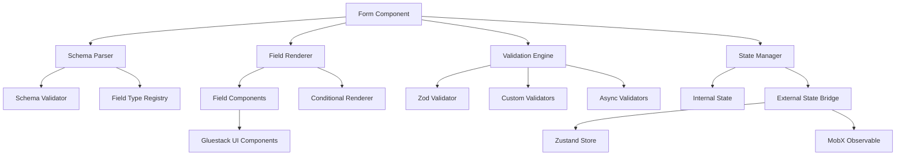

# Design Document

## Overview

The Dynamic Form Component is a comprehensive, schema-driven form solution for React Native applications that leverages Gluestack v3 UI components. The design follows a modular architecture with clear separation of concerns between schema parsing, field rendering, validation, state management, and external integrations.

The component will extend the existing `json-form-lib` package with enhanced capabilities including comprehensive field type support, advanced validation with Zod integration, conditional rendering, dynamic option loading, and seamless integration with Zustand/MobX state management systems.

## Architecture

### Core Architecture Principles

1. **Schema-Driven**: All form behavior is defined through JSON schemas
2. **Component Composition**: Leverages Gluestack v3's component system for consistent UI
3. **Plugin Architecture**: Extensible field types and validation rules
4. **State Management Agnostic**: Supports multiple state management solutions
5. **Performance Optimized**: Minimal re-renders through optimized state updates

### High-Level Architecture



## Components and Interfaces

### Core Components

#### 1. Form Component (`Form.tsx`)

The main form component that orchestrates all functionality. Maintains backward compatibility with existing API.

```typescript
// Event handlers interface
interface FormEvents<T = Record<string, any>> {
  change?: (values: Partial<T>) => void;
  submit?: (values: T) => void | Promise<void>;
  reset?: () => void;
  validationChange?: (isValid: boolean, errors: ValidationErrors) => void;
  mount?: () => void;
  unmount?: () => void;
}

// Backward compatible props (existing API)
interface LegacyFormProps<T = Record<string, any>> {
  formSchema: IFormSchema; // Existing schema format
  formData?: Record<string, any>; // Existing initial values
  events?: FormEvents<T>; // Event handlers object
  onSubmit?: (values: T) => void | Promise<void>; // Deprecated but supported
}

// Enhanced props (new API)
interface EnhancedFormProps<T = Record<string, any>> {
  schema: FormSchema; // New enhanced schema format
  initialValues?: Partial<T>;
  events?: FormEvents<T>; // Event handlers object
  stateManager?: StateManagerConfig;
  className?: string;
  disabled?: boolean;
}

// Union type for backward compatibility
type FormProps<T = Record<string, any>> =
  | LegacyFormProps<T>
  | EnhancedFormProps<T>;

interface FormRef<T = Record<string, any>> {
  submit: () => Promise<void>;
  reset: () => void;
  validate: () => Promise<ValidationResult>;
  setFieldValue: (fieldId: string, value: any) => void;
  getFieldValue: (fieldId: string) => any;
  getValues: () => T;
  setValues: (values: Partial<T>) => void;
}
```

#### 2. Schema Parser (`SchemaParser.ts`)

Parses and validates form schemas, resolving field types and dependencies. Handles both legacy and enhanced schema formats.

```typescript
interface SchemaParser {
  parse(schema: FormSchema | IFormSchema): ParsedSchema;
  validate(schema: FormSchema | IFormSchema): SchemaValidationResult;
  resolveFieldDependencies(schema: FormSchema | IFormSchema): DependencyGraph;
  isLegacySchema(schema: any): schema is IFormSchema;
  convertLegacySchema(schema: IFormSchema): FormSchema;
}

interface ParsedSchema {
  fields: ParsedField[];
  validation: ValidationSchema;
  conditionalRules: ConditionalRule[];
  dependencies: DependencyGraph;
}
```

#### 3. Field Renderer (`FieldRenderer.tsx`)

Renders individual form fields based on their type and configuration.

```typescript
interface FieldRenderer {
  render(field: ParsedField, context: RenderContext): React.ReactElement;
  registerFieldType(type: string, component: FieldComponent): void;
  getFieldComponent(type: string): FieldComponent | undefined;
}

interface RenderContext {
  values: Record<string, any>;
  errors: ValidationErrors;
  touched: Record<string, boolean>;
  isSubmitting: boolean;
  disabled: boolean;
}
```

#### 4. Validation Engine (`ValidationEngine.ts`)

Handles all validation logic including schema validation, custom rules, and async validation.

```typescript
interface ValidationEngine {
  validate(
    values: Record<string, any>,
    schema: ValidationSchema
  ): Promise<ValidationResult>;
  validateField(
    fieldId: string,
    value: any,
    schema: FieldValidationSchema
  ): Promise<FieldValidationResult>;
  addCustomValidator(name: string, validator: CustomValidator): void;
}

interface ValidationResult {
  isValid: boolean;
  errors: ValidationErrors;
  warnings?: ValidationWarnings;
}
```

### Field Type System

#### Base Field Interface

```typescript
interface BaseField {
  id: string;
  type: FieldType;
  label: string;
  placeholder?: string;
  description?: string;
  required?: boolean;
  disabled?: boolean;
  readonly?: boolean;
  defaultValue?: any;
  validation?: FieldValidation;
  conditional?: ConditionalConfig;
  className?: string;
  style?: ViewStyle;
}
```

#### Supported Field Types

```typescript
type FieldType =
  | "text"
  | "password"
  | "email"
  | "number"
  | "textarea"
  | "select"
  | "multiselect"
  | "radio"
  | "checkbox"
  | "switch"
  | "date"
  | "time"
  | "datetime"
  | "file"
  | "slider"
  | "rating"
  | "color"
  | "array"
  | "object"
  | "custom";

interface TextField extends BaseField {
  type: "text" | "password" | "email";
  maxLength?: number;
  minLength?: number;
  autoCapitalize?: "none" | "sentences" | "words" | "characters";
  autoCorrect?: boolean;
}

interface NumberField extends BaseField {
  type: "number";
  min?: number;
  max?: number;
  step?: number;
  precision?: number;
}

interface SelectField extends BaseField {
  type: "select" | "multiselect";
  options: SelectOption[] | DynamicOptionsConfig;
  searchable?: boolean;
  clearable?: boolean;
  multiple?: boolean;
}

interface DateField extends BaseField {
  type: "date" | "time" | "datetime";
  minDate?: Date;
  maxDate?: Date;
  format?: string;
  locale?: string;
}
```

### State Management Integration

#### State Manager Bridge

```typescript
interface StateManagerConfig {
  type: "zustand" | "mobx" | "internal";
  store?: any;
  selector?: (state: any) => any;
  updater?: (state: any, values: Record<string, any>) => void;
}

interface StateManagerBridge {
  connect(config: StateManagerConfig): void;
  disconnect(): void;
  syncToExternal(values: Record<string, any>): void;
  syncFromExternal(): Record<string, any>;
  subscribe(callback: (values: Record<string, any>) => void): () => void;
}
```

## Data Models

### Form Schema

```typescript
// Existing schema format (backward compatibility)
interface IFormSchema {
  formConfig: {
    id: string;
    buttons?: Array<{
      id: string;
      label: string;
      variant?: "contained" | "outlined" | "text";
      color?: "primary" | "secondary" | "default";
      type?: "submit" | "reset" | "button";
    }>;
  };
  formElements: Array<IFormElement>;
}

interface IFormElement {
  id: string;
  label: string;
  type: "textbox" | "password" | "number" | "checkbox";
}

// Enhanced schema format (new capabilities)
interface FormSchema {
  id: string;
  title?: string;
  description?: string;
  fields: Field[];
  validation?: GlobalValidation;
  layout?: LayoutConfig;
  styling?: StylingConfig;
  behavior?: BehaviorConfig;
}

interface GlobalValidation {
  schema?: ZodSchema;
  customRules?: CustomValidationRule[];
  validateOnChange?: boolean;
  validateOnBlur?: boolean;
  validateOnSubmit?: boolean;
}

interface LayoutConfig {
  type: "vertical" | "horizontal" | "grid" | "custom";
  spacing?: number;
  columns?: number;
  responsive?: ResponsiveConfig;
}
```

### Validation Schema

```typescript
interface FieldValidation {
  required?: boolean | ConditionalRule;
  schema?: ZodSchema;
  regex?: RegExp;
  custom?: CustomValidationRule[];
  async?: AsyncValidationRule[];
  debounceMs?: number;
}

interface CustomValidationRule {
  name: string;
  message: string;
  validator: (value: any, allValues: Record<string, any>) => boolean | string;
}

interface AsyncValidationRule {
  name: string;
  message: string;
  validator: (
    value: any,
    allValues: Record<string, any>
  ) => Promise<boolean | string>;
  debounceMs?: number;
}
```

### Conditional Rendering

```typescript
interface ConditionalConfig {
  show?: ConditionalRule[];
  hide?: ConditionalRule[];
  enable?: ConditionalRule[];
  disable?: ConditionalRule[];
  require?: ConditionalRule[];
}

interface ConditionalRule {
  field: string;
  operator:
    | "equals"
    | "not_equals"
    | "contains"
    | "not_contains"
    | "greater_than"
    | "less_than"
    | "in"
    | "not_in"
    | "custom";
  value: any;
  customRule?: (fieldValue: any, allValues: Record<string, any>) => boolean;
}
```

### Dynamic Options

```typescript
interface DynamicOptionsConfig {
  source: "api" | "function" | "store";
  url?: string;
  method?: "GET" | "POST";
  headers?: Record<string, string>;
  params?: Record<string, any>;
  transform?: (data: any) => SelectOption[];
  dependencies?: string[];
  cache?: boolean;
  cacheKey?: string;
  cacheDuration?: number;
}

interface SelectOption {
  label: string;
  value: any;
  disabled?: boolean;
  group?: string;
  icon?: string;
  description?: string;
}
```

## Error Handling

### Error Types

```typescript
interface FormError extends Error {
  type: "schema" | "validation" | "network" | "runtime";
  field?: string;
  code?: string;
  details?: any;
}

interface ValidationErrors {
  [fieldId: string]: string[];
}

interface ErrorBoundaryConfig {
  fallback?: React.ComponentType<{ error: FormError; retry: () => void }>;
  onError?: (error: FormError) => void;
  resetOnPropsChange?: boolean;
}
```

### Error Recovery

- Graceful degradation for unsupported field types
- Retry mechanisms for failed async operations
- Fallback UI components for rendering errors
- Error boundary integration for component-level errors

## Testing Strategy

### Unit Testing

- **Schema Parser**: Test schema validation and parsing logic
- **Field Components**: Test individual field rendering and behavior
- **Validation Engine**: Test all validation rules and edge cases
- **State Management**: Test state synchronization and updates

### Integration Testing

- **Form Submission**: Test complete form submission workflows
- **Conditional Logic**: Test field visibility and dependency chains
- **Dynamic Options**: Test option loading and caching
- **External State**: Test Zustand/MobX integration

### Performance Testing

- **Rendering Performance**: Test with large forms (100+ fields)
- **Validation Performance**: Test complex validation scenarios
- **Memory Usage**: Test for memory leaks in long-running forms
- **Bundle Size**: Ensure tree-shaking works correctly

### Accessibility Testing

- **Screen Reader**: Test with VoiceOver/TalkBack
- **Keyboard Navigation**: Test tab order and keyboard interactions
- **Color Contrast**: Ensure WCAG compliance
- **Focus Management**: Test focus states and indicators

## Implementation Phases

### Phase 1: Core Infrastructure

1. Enhanced schema types and interfaces
2. Basic field renderer with Gluestack v3 integration
3. Internal state management
4. Basic validation with Zod

### Phase 2: Field Types

1. Text-based fields (text, password, email, textarea)
2. Selection fields (select, radio, checkbox, switch)
3. Numeric fields (number, slider, rating)
4. Date/time fields

### Phase 3: Advanced Features

1. Conditional rendering engine
2. Dynamic option loading
3. Custom validation rules
4. Async validation

### Phase 4: External Integrations

1. Zustand integration
2. MobX integration
3. External control via refs
4. Advanced error handling

### Phase 5: Performance & Polish

1. Performance optimizations
2. Accessibility improvements
3. Documentation and examples
4. Testing suite completion

## Dependencies

### Required Dependencies

- `@gluestack-ui/core` - UI component system
- `zod` - Schema validation (already available)
- `react` & `react-native` - Core framework

### Optional Dependencies

- `zustand` - State management integration
- `mobx` - Alternative state management
- `react-hook-form` - Potential integration for advanced use cases

### Development Dependencies

- `@testing-library/react-native` - Testing utilities
- `jest` - Test runner
- `typescript` - Type checking
